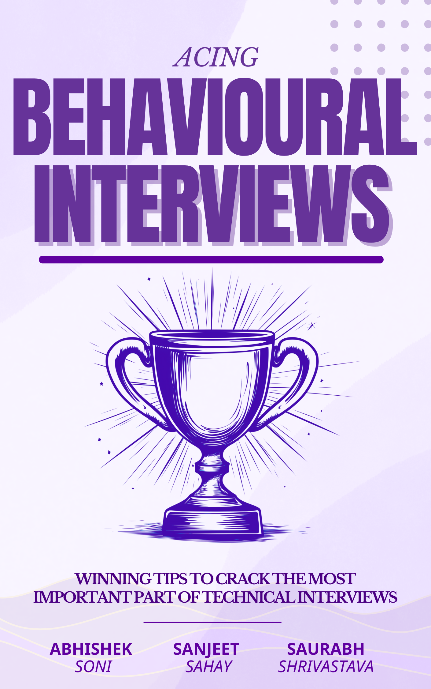

= Acing Behavioural Interviews: Winning tips to crack the most important part of the interviews
:author: Sanjeet Sahay
:email: sanjeet@leaderhub.io
:doctype: book
:toc: macro
:toclevels: 2
:sectnums: 
:sectnumlevels: 2
:epub3-stylesdir: styles
:front-cover-image: 
:pdf-themesdir: themes
:pdf-theme: pdf-theme.yml
:pdf-fontsdir: fonts
:media: prepress

// ^ These attributes help generate automatic numbering for parts/chapters.

// Front Matter

// include::front-matter/toc.adoc[]

include::front-matter/preface.adoc[]

include::front-matter/introduction.adoc[]

// main contents

include::parts/part1.adoc[]

include::chapters/ch01.adoc[]

include::chapters/ch02.adoc[]

include::chapters/ch03.adoc[]

include::parts/part2.adoc[]

include::chapters/ch04.adoc[]

include::chapters/ch05.adoc[]

include::chapters/ch06.adoc[]

include::parts/part3.adoc[]

include::chapters/ch07.adoc[]

include::chapters/ch08.adoc[]

include::chapters/ch09.adoc[]

include::chapters/ch10.adoc[]

include::chapters/ch11.adoc[]

include::parts/part4.adoc[]

include::chapters/ch12.adoc[]

include::chapters/ch13.adoc[]

// Back Matter

include::back-matter/about.adoc[]

include::back-matter/epilogue.adoc[]

// include::back-matter/epilogue.adoc[]

